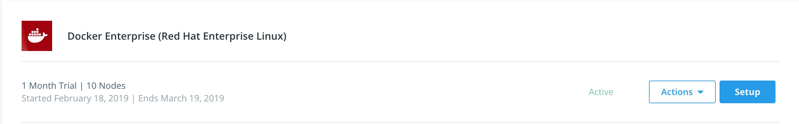
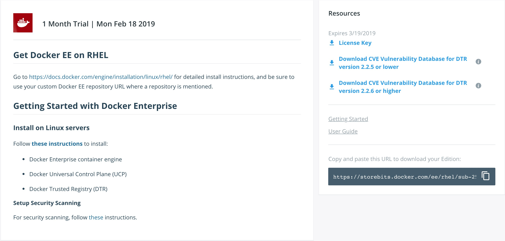

# Docker EE Install Cheat Sheet

## Get a Trial

30 day trial : [https://hub.docker.com/search/?q=&type=edition&offering=enterprise&operating_system=linux](https://hub.docker.com/search/?q=&type=edition&offering=enterprise&operating_system=linux)

## Node Sizing - Port Requirements

* UCP - 4 core(vcpu) x 16GB Ram X 100GB free in `/var/lib/` for `kubelet` and `docker`. *Increase CPU and RAM as cluster grows.*
* DTR - 4 core(vcpu) x 16GB Ram X 250GB free in `/var/lib/` for `kubelet` and `docker`. *Increase CPU and RAM to improve CVE Scanning.*
  * Storage is dependent on if external storage for DTR is used.
* Worker - 4 core(vcpu) x 16GB Ram X 100GB free in `/var/lib/` for `kubelet` and `docker`. *Increase as container workload increases.*

Make sure the ports are open between ALL nodes.

* [Docker UCP System Requirements](https://docs.docker.com/ee/ucp/admin/install/system-requirements/)

## Get Docker EE RPMS, License, and Offline CVE

Get RPMS from your **PRIVATE** storebits url. The url location is located on [hub.docker.com](https://hub.docker.com/) under "My Content". Example url https://hub.docker.com/u/$HUB_ID/content. Then click "Setup".



Notice the `https://storebits.docker.com/ee/...` link in the lower right. This is where the rpms can be downloaded for offline use.
Example url for getting the YUM repo file `https://storebits.docker.com/ee/rhel/sub-.../docker-ee.repo`.



Make sure to **DOWNLOAD** at least the License and CVE file.

## Install Docker EE Engine (All Nodes)

If you are online follow the [Centos Engine Install docs](https://docs.docker.com/install/linux/docker-ee/centos/#set-up-the-repository).

If you are offline, download the RPMs to the node or setup a local http/nfs repo. OR local install with:

```bash
yum install -y docker-ee-18.09.2-3.el7.x86_64.rpm docker-ee-cli-18.09.2-3.el7.x86_64.rpm containerd.io-1.2.2-3.3.el7.x86_64.rpm
```

## Tune Docker EE Engine (All Nodes)

[Kernel Tuning](https://github.com/clemenko/best_practices#kernel)

```bash
echo "vm.swappiness=0" >> /etc/sysctl.conf # turn off swapping unless necessary
echo "vm.overcommit_memory=1" >> /etc/sysctl.conf # allowing oversubscription
echo "net.ipv4.neigh.default.gc_thresh1 = 80000" >> /etc/sysctl.conf # arp cache fixes
echo "net.ipv4.neigh.default.gc_thresh2 = 90000" >> /etc/sysctl.conf # arp cache fixes
echo "net.ipv4.neigh.default.gc_thresh3 = 100000" >> /etc/sysctl.conf # arp cache fixes
echo "net.ipv4.tcp_keepalive_time=600" >> /etc/sysctl.conf # decrease the tcp timeout for ipvs
echo "net.ipv4.ip_forward=1" >> /etc/sysctl.conf # needed for iptables
echo "fs.may_detach_mounts=1" >> /etc/sysctl.conf # needed for host mountpoints with RHEL 7.4
echo "fs.inotify.max_user_instances=8192" >> /etc/sysctl.conf # monitor file system events
echo "fs.inotify.max_user_watches=1048576" >> /etc/sysctl.conf # monitor file system events
sysctl -p
```
Details on all of these items available [here](tuning.md)

[Daemon Tuning Recommendations](https://github.com/clemenko/best_practices#daemon-)

```bash
docker plugin disable docker/telemetry:1.0.0.linux-x86_64-stable
echo -e "{\n \"selinux-enabled\": true, \n \"log-driver\": \"json-file\", \"log-opts\": {\"max-size\": \"10m\", \"max-file\": \"3\"}, \n}" > /etc/docker/daemon.json
 systemctl restart docker
 ```

## Offline UCP/DTR images

Download Offline tar balls.
[UCP Offline](https://docs.docker.com/ee/ucp/admin/install/install-offline/#versions-available)
[DTR Offline](https://docs.docker.com/ee/dtr/admin/install/install-offline/#versions-available)

Once downloaded, then load the images on the nodes that need it.

```bash
docker load < ucp.tar.gz #all nodes
docker load < dtr.tar.gz #on only DTR nodes
```

## Install UCP (First UCP Node)

[UCP Install Docs](https://docs.docker.com/ee/ucp/admin/install/#step-4-install-ucp)

```bash
docker container run --rm -it --name ucp --security-opt label=disable \
  -v /var/run/docker.sock:/var/run/docker.sock docker/ucp:3.1.2 install \
  --host-address <node-ip-address> --interactive
```

## Configure UCP (First UCP Node)

Configure UCP with License, External Certs, and LDAP/AD before adding any new managers or worker nodes.

* [Licensing UCP](https://docs.docker.com/ee/ucp/admin/configure/license-your-installation/)
* [Adding External Certs](https://docs.docker.com/ee/ucp/admin/configure/use-your-own-tls-certificates/)
* [Configuring LDAP](https://docs.docker.com/ee/ucp/admin/configure/external-auth/)
* [Setup High Availability](https://docs.docker.com/ee/ucp/admin/configure/join-nodes/)

## Join Nodes to Cluster (All other nodes)

[Joining Nodes](https://docs.docker.com/ee/ucp/admin/configure/join-nodes/join-linux-nodes-to-cluster/)

## Custom Load Balancer for HA

If you can't use a Netscaler, ELB, or F5. [Set up a custom LB](https://docs.docker.com/ee/ucp/admin/configure/join-nodes/use-a-load-balancer/).

## Install Docker Trusted Registry (First DTR Node)

The DTR install script can be generated from UCP. [UCP settings for installing DTR](https://docs.docker.com/ee/dtr/admin/install/#step-3-install-dtr).

Please note that `ucp-node` is the name of the worker where to install DTR. Specifically its the node name that UCP knows. Example install command.

```bash
docker run -it --rm docker/dtr:2.6.2 install --ucp-node <ucp-node-name> --ucp-insecure-tls
```

## Configure DTR (First DTR Node)

Configure DTR before adding new replicas.

* [Add External Certs](https://docs.docker.com/ee/dtr/admin/configure/use-your-own-tls-certificates/)
* [Add S3 External Storage](https://docs.docker.com/ee/dtr/admin/configure/external-storage/s3/)
* [Add NFS External Storage](https://docs.docker.com/ee/dtr/admin/configure/external-storage/nfs/)
* [Setup a Custom Load Balancer](https://docs.docker.com/ee/dtr/admin/configure/use-a-load-balancer/)

## Add DTR Replicas  (Additional DTR Nodes)

Please note about only having odd number DTR servers. [Join DTR Replicas](https://docs.docker.com/ee/dtr/admin/configure/set-up-high-availability/#join-more-dtr-replicas)
